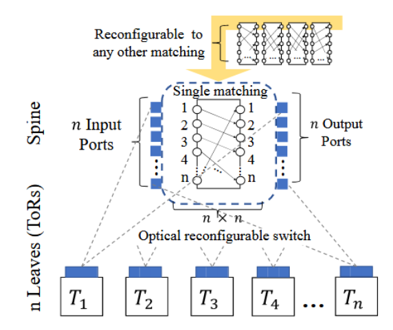

## Description
This project contains the code used to obtain the results from the paper:

Griner, Chen, and Chen Avin. "Integrated Topology and Traffic Engineering for Reconfigurable Datacenter Networks." arXiv preprint arXiv:2402.09115 (2024). 		

It's propose is to allow replication of the results found in the paper and further study into topology engineering of dynamic networks.


[//]: # ()

<div style="width:100%; margin: auto;">


</div>

## Table of Contents
1. [Installation](#installation)
2. [Usage](#usage)
3. [Data](#data)
4. [License](#license)

[//]: # (5. [Acknowledgements]&#40;#acknowledgements&#41;)

## Installation
You can create a new conda environment and install the required libraries using the `environment.yml` file.
Open your terminal or command prompt and run the following command:

```commandline
conda env create -f environment.yml
```
Or use the `requirements.txt` to install all dependencies.

This project also requires a julia package called [BirkhoffDecomposition](https://github.com/vvalls/BirkhoffDecomposition.jl/tree/master)
in order to implement Birkhoff-von-Neumann (BvN) decomposition.


After installing [juliacall](https://pypi.org/project/juliacall/). 
You could run the flowing code, that will install the package into the julia environment.
```python
import juliacall
jl = juliacall.newmodule("SomeName")
jl.seval("import Pkg")
jl.seval("Pkg.add(\"BirkhoffDecomposition\")")
```

## Usage
To recreate all the results found in the paper with _our_ parameters
In main.py run
```python
recreate_paper_results()
```
The generated results will contain the DCT for each of our three systems (_"BvN-sys"_, _"RR-sys"_, _"COMP-sys"_) as well as more general
statistics regrading the traffic matrix and the "_pivot_" algorithm.

More generally it is possible to run our experiments with different parameters.
For example to test our systems with different traffic model parameters (`large_ratio` and `large_load_ratio`), a network with 32 nodes (`n`), and a reconfiguration
rate (`rd`) of 0.02 seconds you may run

```python
from src.testing_functions import *

directory = "dir_to_save_results"
run_test_of_total_flow_number_change(directory, large_ratio=0.01, large_load_ratio=0.8, n=32, rd=0.02)
```

Running the rest of the code in `main.py` will 
generate and save paper figures equivalent to figures 4,5 and 6.

It is possible to test each system separately with a single traffic matrix. Please refer to
documentation.

## Data 

The folder [test_res](.\test_res) contains 5 `.json` files.
Each having the data for the results of the tests used in the paper.

A full description of their fields can be found in [DATA_README](test_res/DATA_README.md)


## License
This uses an MIT license

[//]: # (## Acknowledgements)


