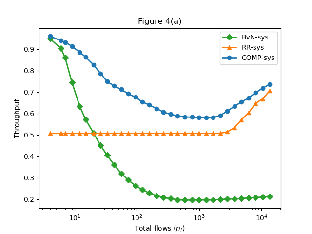

## Description
This project contains the code used to obtain the results from the paper:

Griner, Chen, and Chen Avin. "Integrated Topology and Traffic Engineering for Reconfigurable Datacenter Networks." arXiv preprint arXiv:2402.09115 (2024). 		



## Table of Contents
1. [Installation](#installation)
2. [Usage](#usage)
3. [Data](#data)
4. [Contributing](#contributing)
5. [License](#license)
6. [Acknowledgements](#acknowledgements)

## Installation
You can create a new conda environment and install the required libraries using the `environment.yml` file.
Open your terminal or command prompt and run the following command:

```commandline
conda env create -f environment.yml
```
Or use the `requirements.txt` to install all dependencies.

This project also requires a julia package called [BirkhoffDecomposition](https://github.com/vvalls/BirkhoffDecomposition.jl/tree/master)
in order to implement Birkhoff-von-Neumann (BvN) decomposition.
```conda``

After installing [juliacall](https://pypi.org/project/juliacall/). 
You could run the flowing code, that will install the package into the julia environment.
```python
import juliacall
jl = juliacall.newmodule("SomeName")
jl.seval("import Pkg")
jl.seval("Pkg.add(\"BirkhoffDecomposition\")")
```

## Usage
In main.py run
```python
recreate_paper_results()
```
To recreate the results in the paper
## Data 

The folder [test_res](.\test_res) contatines 5 `json` files.
Each having the data for the results of the tests used in the paper.

## License

